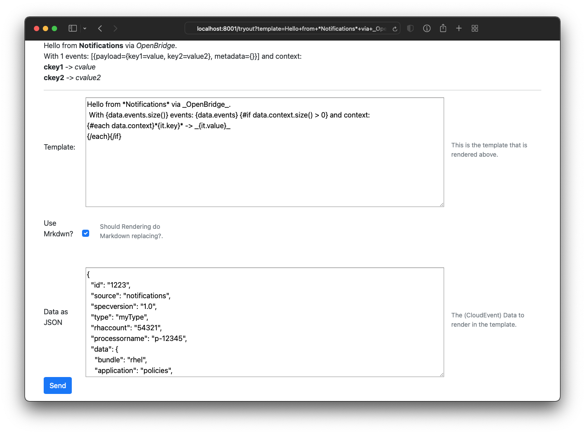

= Qute-tester project

This project uses Qute to Interactively try Qute templates.
To learn more about Qute, check out the https://quarkus.io/guides/qute-reference[Qute reference guide].

== Running the application

=== As a container

Easiest is probably to run the application as a container

[source, shell script]
----
docker run --rm -i -p 8001:8001 quay.io/pilhuhn/qute-tester
----

And then hit the application at http://localhost:8001/tryout.

=== In development mode

If you want to change the application and run a local copy of this repository,
you can run your application in Quarkus dev mode that enables live coding using:

[source,shell script]
----
mvn compile quarkus:dev
----

The application listens on port 8001 at http://localhost:8001/tryout

== Using the app

Navigate your browser to http://localhost:8001/tryout[], and it will show a display like the following:

image::screenshot.png[]

Modify either the template or the input data (CloudEvent, but any json will do) and
press the _send_ button to render the template.

If you select the _Use Mrkdwn' checkbox, some additional transformation of the output of the
rendered template will be applied.
In this case and markdown constructs like using *, _, ~ and ` for bold, italics, strike-through and code are translated into their html variants before displaying.
This is to make it a bit more obvious if the template is rendered as desired in that case.
The same applies for newlines `\n` .

The following shows this with the same template and data as above:

