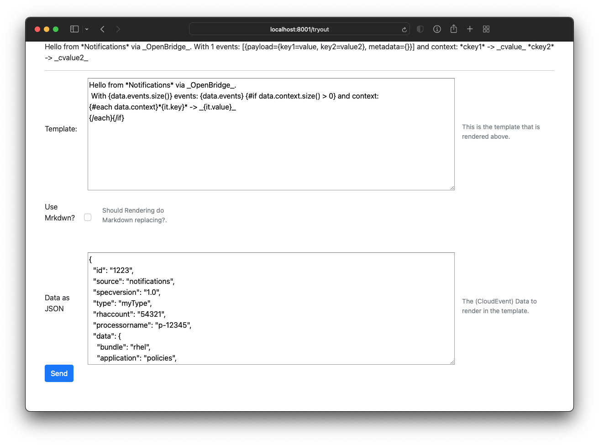

= Qute-tester project

This project uses Qute to Interactively try Qute templates


## Running the application in dev mode

You can run your application in dev mode that enables live coding using:
```shell script
mvn compile quarkus:dev
```

The application listens on port 8001 at http://localhost:8001/tryout

And will show a screen like the following:



Modify either the template or the input data (CloudEvent, but any json will do) and
press the _send_ button to render the template.
